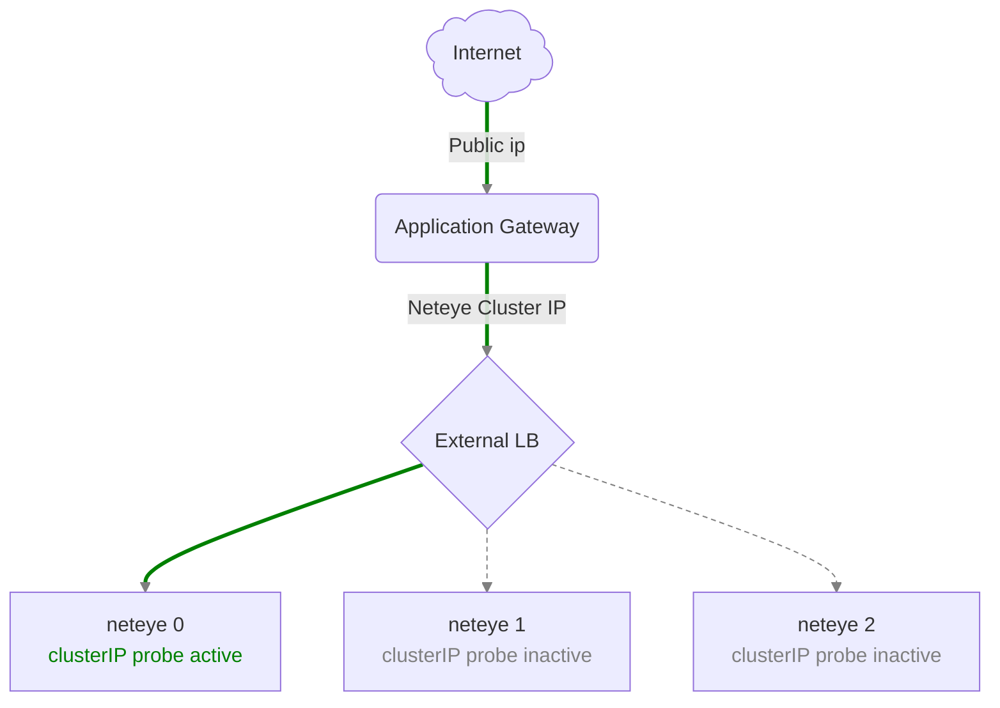
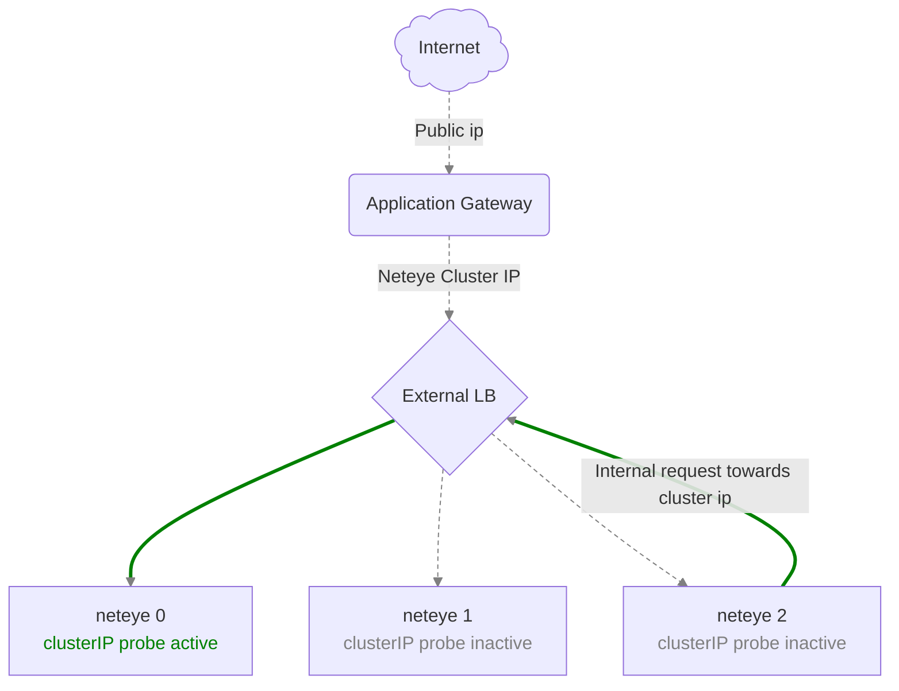
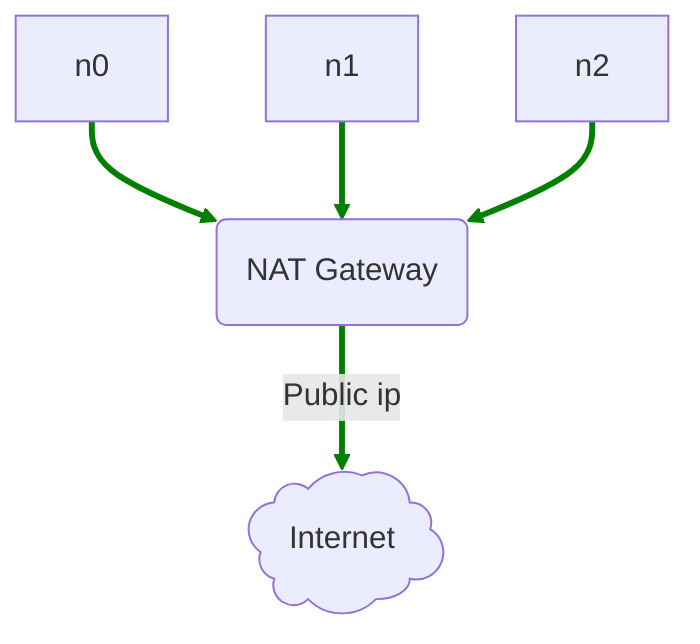
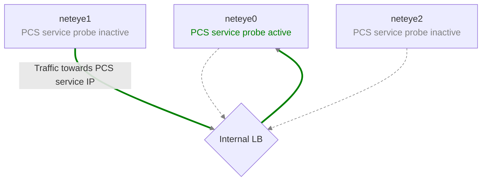

# Architecture Diagrams
The architecture of Neteye on Azure is designed to leverage the cloud platform's capabilities and therefore may differ from traditional on-premises deployments.

The following diagrams illustrate the key components and their interactions within the Neteye deployment on Azure.
## Incoming Traffic
All the incoming traffic from internet (directed to the webui) is routed through an Application Gateway which secure and
forwards the traffic to a Load Balancer (External LB) that distributes the requests to the Neteye nodes based on their health status.

The Load Balancer uses the same Cluster IP as the Neteye cluster and relies on pcs health probes 
to determine which node has currently assigned the Cluster IP.

> [!NOTE]
> No public IP is therefore assigned directly to the Neteye nodes. SSH access is only possible via a Bastion Host or via a
> VPN connection to the virtual network.

## Internal Traffic Towards Cluster IP
If a Neteye node needs to communicate with the Cluster IP (e.g. for internal API calls), all requests are routed back to
the External Load Balancer that forwards them to the node currently owning the Cluster IP.

## Traffic towards Internet
Otherwise, all outgoing traffic from the Neteye nodes towards external networks is routed through a NAT Gateway. 

This ensures that the outgoing traffic uses a consistent public IP address (useful for ip filtering).

## Traffic between Neteye Nodes
All traffic directed towards a pacemaker virtual IP is routed through an Internal Load Balancer, which detects via pcs health probes
which node currently owns the virtual IP and forwards the traffic accordingly.

All the remaining traffic between the Neteye nodes is routed directly without any load balancer.